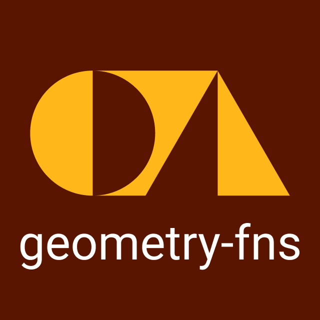

<div align="center">
  <h1>
    
  </h1>
  <p>A JavaScript utility library for geometry.</p>
  <p>
    
    
  </p>
</div>

## Features

- Lightweight.
- Pure functions.
- TypeScript declarations included.
- ESM package.

## Installation

```bash
bun add @haydn/geometry-fns
deno add npm:@haydn/geometry-fns
npm install @haydn/geometry-fns
pnpm add @haydn/geometry-fns
yarn add @haydn/geometry-fns
```

## Usage

```js
import { createCircle } from "@haydn/geometry-fns";

const circle = createCircle([1, 2], 2);
//=> Circle { center: [1, 2], radius: 2 }

translate(circle, [1, 2]);
//=> Circle { center: [2, 4], radius: 2 }
```

<!-- TSDOC_START -->

## :toolbox: Functions

- [anchorToPoint](#gear-anchortopoint)
- [angleBetween](#gear-anglebetween)
- [brandCircle](#gear-brandcircle)
- [brandRectangle](#gear-brandrectangle)
- [createCircle](#gear-createcircle)
- [createRectangle](#gear-createrectangle)
- [distance](#gear-distance)
- [intersectRectangle](#gear-intersectrectangle)
- [isWithinCircle](#gear-iswithincircle)
- [isWithinPolygon](#gear-iswithinpolygon)
- [isWithinRectangle](#gear-iswithinrectangle)
- [isWithinSegment](#gear-iswithinsegment)
- [polygonFromRectangle](#gear-polygonfromrectangle)
- [polygonFromCircle](#gear-polygonfromcircle)
- [normalizeCircle](#gear-normalizecircle)
- [normalizeRectangle](#gear-normalizerectangle)
- [print](#gear-print)
- [sizeOfCircle](#gear-sizeofcircle)
- [sizeOfRectangle](#gear-sizeofrectangle)
- [translate](#gear-translate)

### :gear: anchorToPoint

Converts shorthand anchor strings (e.g. `"tl"` or `"cr"`) to the equivalent point or, if a point
is provided, normalizes it.

| Function | Type |
| ---------- | ---------- |
| `anchorToPoint` | `(anchor: Anchor) => Vec2` |

Parameters:

* `anchor`: Either a shorthand string (e.g. `"tl"` or `"cr"`) or a point (e.g. `[1, 0]`).


Returns:

A normalized point where the x and y values are between 0 and 1.

Examples:

```ts
anchorToPoint("tl");
//=> [0, 0]

anchorToPoint("bc");
//=> [0.5, 1]

anchorToPoint([100, 0]);
//=> [1, 0]

anchorToPoint([-100, 0]);
//=> [0, 0]
```


### :gear: angleBetween

Calculates the angle between point a and point b.

| Function | Type |
| ---------- | ---------- |
| `angleBetween` | `(a: Vec2, b: Vec2) => number` |

Parameters:

* `a`: The first point.
* `b`: The second point.


Returns:

The angle between the two points in radians where 0 is the three o'clock position.

Examples:

```ts
angleBetween([0, 0], [1, 0]);
//=> 0

angleBetween([0, 0], [0, 1]);
//=> Math.PI / 2

angleBetween([0, 0], [-1, 0]);
//=> Math.PI

angleBetween([0, 0], [0, -1]);
//=> -Math.PI / 2
```


### :gear: brandCircle

Brands a circle primitive for type safety.

| Function | Type |
| ---------- | ---------- |
| `brandCircle` | `(circle: [Vec2, Vec2]) => Circle` |

Parameters:

* `circle`: The circle to brand.


Returns:

The branded circle primitive.

Examples:

```ts
brandCircle([[0, 0], [1, 0]]);
//=> Circle { center: (0,0), radius: 1 }
```


### :gear: brandRectangle

Brands a rectangle primitive for type safety.

| Function | Type |
| ---------- | ---------- |
| `brandRectangle` | `(rectangle: [Vec2, Vec2]) => Rectangle` |

Parameters:

* `rectangle`: The rectangle to brand.


Returns:

The branded rectangle primitive.

Examples:

```ts
brandRectangle([[0, 0], [1, 1]]);
//=> Rectangle { position: (0,0), width: 1, height: 1 }
```


### :gear: createCircle

Constructs a circle primitive.

| Function | Type |
| ---------- | ---------- |
| `createCircle` | `(center: Vec2, radius: number, anchor?: Anchor) => Circle` |

Parameters:

* `radius`: The radius of the circle.


Returns:

A circle object where the first vector is the center and the second is offset to the
right by the radius amount.

Examples:

```ts
createCircle([0, 0], 1);
//=> Circle { center: (0,0), radius: 1 }
```


### :gear: createRectangle

Constructs a rectangle primitive.

| Function | Type |
| ---------- | ---------- |
| `createRectangle` | `(position: Vec2, width: number, height: number, anchor?: Anchor) => Rectangle` |

Parameters:

* `width`: The width of the rectangle. If a negative value is provided, its absolute value will
be used.
* `height`: The height of the rectangle. If a negative value is provided, its absolute value
will be used.


Returns:

A normalized rectangle.

Examples:

```ts
createRectangle([0, 0], 2, 3);
//=> Rectangle { position: (0,0), width: 2, height: 3 }
```


### :gear: distance

Calculates the absolute distance between two points.

| Function | Type |
| ---------- | ---------- |
| `distance` | `(a: Vec2, b: Vec2) => number` |

Parameters:

* `a`: The first point.
* `b`: The second point.


Returns:

The absolute distance between the two points.

Examples:

```ts
distance([0, 0], [3, 4]);
//=> 5
```


### :gear: intersectRectangle

Calculates the intersection of two rectangles.

| Function | Type |
| ---------- | ---------- |
| `intersectRectangle` | `(a: Rectangle, b: Rectangle) => Rectangle or null` |

Parameters:

* `a`: The first rectangle.
* `b`: The second rectangle.


Returns:

The intersection of the two rectangles, or null if they do not intersect.

Examples:

```ts
intersectRectangle(createRectangle([0, 0], 10, 10), createRectangle([5, 5], 15, 15));
//=> Rectangle { position: (5,5), width: 10, height: 10 }
```


### :gear: isWithinCircle

Determines if a point is within a circle. Points on the circumference are considered within the
circle.

| Function | Type |
| ---------- | ---------- |
| `isWithinCircle` | `(point: Vec2, circle: Circle) => boolean` |

Parameters:

* `point`: The point to check.
* `circle`: The circle to check against.


Returns:

True if the point is within the circle, false otherwise.

Examples:

```ts
isWithinCircle([0, 0], createCircle([0, 0], 10));
//=> true
```


### :gear: isWithinPolygon

Determines if a point is within a polygon. Points on the boundary are considered within the
polygon. Will always return false if the polygon is empty. Points on the boundary are considered
within the polygon.

| Function | Type |
| ---------- | ---------- |
| `isWithinPolygon` | `(point: Vec2, polygon: Polygon) => boolean` |

Parameters:

* `point`: The point to check.
* `polygon`: The polygon to check against.


Returns:

True if the point is within the polygon, false otherwise.

Examples:

```ts
isWithinPolygon([5, 5], [[0, 0], [10, 0], [10, 10], [0, 10]]);
//=> true
```


### :gear: isWithinRectangle

Determines if a point is within a rectangle. Points on the boundary are
considered within the rectangle.

| Function | Type |
| ---------- | ---------- |
| `isWithinRectangle` | `(point: Vec2, rectangle: Rectangle) => boolean` |

Parameters:

* `point`: The point to check.
* `rectangle`: The rectangle to check against.


Returns:

True if the point is within the rectangle, false otherwise.

Examples:

```ts
isWithinRectangle([5, 5], createRectangle([0, 0], 10, 10));
//=> true
```


### :gear: isWithinSegment

Determines if a point falls somewhere along a segment.

| Function | Type |
| ---------- | ---------- |
| `isWithinSegment` | `(point: Vec2, segment: Segment) => boolean` |

Parameters:

* `point`: The point to check.
* `segment`: The segment to check against.


Returns:

True if the point is on the segment, false otherwise.

Examples:

```ts
isWithinSegment([5, 5], [[0, 0], [10, 10]]);
//=> true
```


### :gear: polygonFromRectangle

Converts a rectangle primitive into a polygon. The points in the resulting polygon are ordered
clockwise starting from the top-left corner.

| Function | Type |
| ---------- | ---------- |
| `polygonFromRectangle` | `(rectangle: Rectangle) => Polygon` |

Parameters:

* `rectangle`: The rectangle to convert.


Returns:

A polygon representation of the rectangle.

Examples:

```ts
polygonFromRectangle(createRectangle([0, 0], 10, 10));
//=> [[0, 0], [10, 0], [10, 10], [0, 10]]
```


### :gear: polygonFromCircle

Converts a circle primitive into a polygon with the specified number of edges. The points in the
resulting polygon are ordered clockwise starting from the three o'clock position.

| Function | Type |
| ---------- | ---------- |
| `polygonFromCircle` | `(circle: Circle, numEdges?: number) => Polygon` |

Parameters:

* `circle`: The circle to convert.
* `numEdges`: The number of edges on the polygon.


Returns:

A polygon representation of the circle.

Examples:

```ts
polygonFromCircle(createCircle([0, 0], 5), 4);
//=> [[5, 0], [0, 5], [-5, 0], [0, -5]]
```


### :gear: normalizeCircle

Normalizes a circle primitive by moving the circumference point to a position directly right of
the origin point (while preserving the radius).

| Function | Type |
| ---------- | ---------- |
| `normalizeCircle` | `(circle: Circle) => Circle` |

Parameters:

* `circle`: The circle to normalize.


Returns:

The normalized circle.

Examples:

```ts
normalizeCircle(brandCircle([[0, 0], [0, 5]]));
//=> [[0, 0], [5, 0]]
```


### :gear: normalizeRectangle

Normalizes a rectangle primitive by ensuring the first point represents the top-left corner and
the second point represents the bottom-right corner.

| Function | Type |
| ---------- | ---------- |
| `normalizeRectangle` | `(rectangle: Rectangle) => Rectangle` |

Parameters:

* `rectangle`: The rectangle to normalize.


Returns:

The normalized rectangle.

Examples:

```ts
normalizeRectangle(brandRectangle([[5, 5], [0, 0]]));
//=> [[0, 0], [5, 5]]
```


### :gear: print

Prints a human-readable representation of a geometric value. Primitives are labeled with their
name and properties.

| Function | Type |
| ---------- | ---------- |
| `print` | `(value: number or Vec2 or Circle or Vec2[] or Rectangle) => string` |

Parameters:

* `value`: The geometric primitive to print.


Returns:

A string representation of value.

Examples:

```ts
print(createCircle([0, 0], 1));
//=> Circle { center: (0,0), radius: 1 }

print(createRectangle([0, 0], 1, 1));
//=> Rectangle { position: (0,0), width: 1, height: 1 }

print([0, 0]);
//=> (0,0)

print([[0, 0], [1, 1]]);
//=> [(0,0), (1,1)]

print(1);
//=> 1

print(Math.PI);
//=> π
```


### :gear: sizeOfCircle

Calculates the radius of a circle primitive. This is the distance between the two points
representing the circle.

| Function | Type |
| ---------- | ---------- |
| `sizeOfCircle` | `(circle: [Vec2, Vec2]) => number` |

Parameters:

* `circle`: A circle represented as a pair of points.


Returns:

The radius of the circle.

Examples:

```ts
sizeOfCircle(createCircle([0, 0], 5));
//=> 5
```


### :gear: sizeOfRectangle

Calculates the width and height of a rectangle. This is the absolute difference between the
x-coordinates and y-coordinates of the two points representing the rectangle.

| Function | Type |
| ---------- | ---------- |
| `sizeOfRectangle` | `(rectangle: [Vec2, Vec2]) => Vec2` |

Parameters:

* `rectangle`: A rectangle represented as a pair of points.


Returns:

The width and height of the rectangle.

Examples:

```ts
sizeOfRectangle(createRectangle([5, 5], 3, 4));
//=> [3, 4]
```


### :gear: translate

Translates a figure by a given amount.

| Function | Type |
| ---------- | ---------- |
| `translate` | `<F extends Figure>(figure: F, offset: Vec2) => F` |

Parameters:

* `figure`: The figure to translate.
* `offset`: The amount to translate the figure.


Returns:

The translated figure.

Examples:

```ts
translate(createRectangle([5, 6], 3, 4), [1, 2]);
//=> Rectangle { position: [6, 7], width: 3, height: 4 }
```


## :cocktail: Types

- [Anchor](#gear-anchor)
- [Circle](#gear-circle)
- [Figure](#gear-figure)
- [Point](#gear-point)
- [Polygon](#gear-polygon)
- [Primitive](#gear-primitive)
- [Rectangle](#gear-rectangle)
- [Segment](#gear-segment)

### :gear: Anchor

A value used to describe an anchor point within a bounding rectangle. This can be either a
two-dimensional vector between 0 and 1 (where 0 is the left or top edge and 1 is the right or
bottom edge), or a shorthand string representing a predefined anchor point (where "tl" is the
top-left corner, "cc" is the center, "br" is the bottom-right corner etc).

| Type | Type |
| ---------- | ---------- |
| `Anchor` | `tl" or "tc" or "tr" or "cl" or "cc" or "cr" or "bl" or "bc" or "br" or Vec2` |

Examples:

```ts
const anchorA: Anchor = [0, 0.8];
const anchorB: Anchor = "bc";
const anchorC: Anchor = [1, 34];
```


### :gear: Circle

A circle primitive represented by the point at the center of the circle and a point on the
circumference. If the point on the circumference is directly to the right of the center point,
then the circle is considered to be normalized.

| Type | Type |
| ---------- | ---------- |
| `Circle` | `[Point, Point] and { [__primitive]: { type: "Circle" } }` |

### :gear: Figure

Any geometric construction represented by an array of points.

| Type | Type |
| ---------- | ---------- |
| `Figure` | `Circle or Polygon or Rectangle or Segment` |

### :gear: Point

A point in 2D space where the first value is the x-coordinate and the second value is the
y-coordinate.

| Type | Type |
| ---------- | ---------- |
| `Point` | `Vec2` |

Examples:

```ts
const point: Point = [12.5, -40.2];
```


### :gear: Polygon

A polygon represented by an array of points.

| Type | Type |
| ---------- | ---------- |
| `Polygon` | `Array<Point>` |

Examples:

```ts
const polygon: Polygon = [[45.67, 12.34], [-23.5, 0], [33.52, -24.6]];
```


### :gear: Primitive

A geometric construction that is an abstract representation of a shape. Extra information beyond
the dimensions of the shape are stored in a hidden property (e.g. the number of edges for a
regular polygon).

| Type | Type |
| ---------- | ---------- |
| `Primitive` | `{ [__primitive]: { type: string } } and (Circle or Rectangle)` |

### :gear: Rectangle

A rectangle primitive represented by two points at opposite corners. If the first point
represents the top-left corner and the second point represents the bottom-right corner, then
the rectangle is considered to be normalized.

| Type | Type |
| ---------- | ---------- |
| `Rectangle` | `[Point, Point] and { [__primitive]: { type: "Rectangle" } }` |

### :gear: Segment

A segment represented by two points.

| Type | Type |
| ---------- | ---------- |
| `Segment` | `[Point, Point]` |

Examples:

```ts
const segment: Segment = [[25, 2], [76, 88]];
```


<!-- TSDOC_END -->
